# ap-examen-ci (macortesro)

## Objetivos
- Proyecto Java 17 + Maven con tests JUnit 5.
- CI en GitHub Actions que ejecuta `mvn test` en cada push/PR.
- Documentación, estructura y evidencias.

## Requisitos
Java 17, Maven 3.9+, Git.

## Estructura

.
├─ pom.xml
├─ src
│ ├─ main/java/com/macortes/App.java
│ └─ test/java/com/macortes/{SumaTest.java,RestaTest.java}
└─ .github/workflows/ci.yml


## Comandos
```bash
mvn -B -U -ntp clean test

git checkout -b feature/ci-setup
git add .
git commit -m "ci: proyecto maven + tests + workflow"
git push -u origin feature/ci-setup

```

## Pipeline

Se ejecuta en push y pull_request.

Sube artefactos JUnit de target/surefire-reports.

## Evidencias


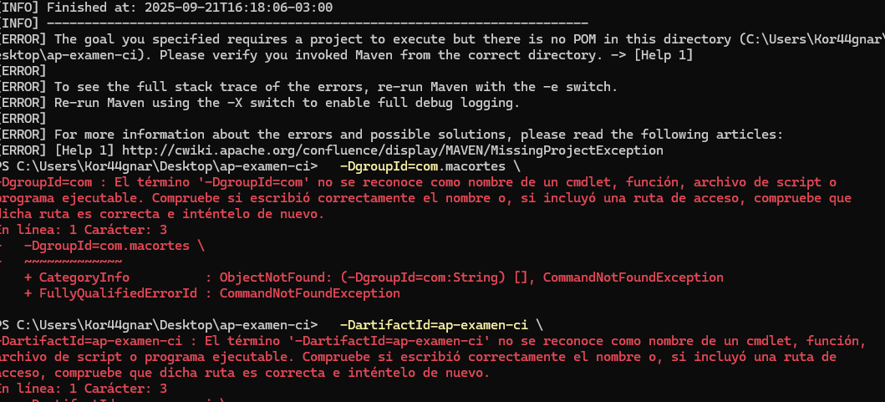
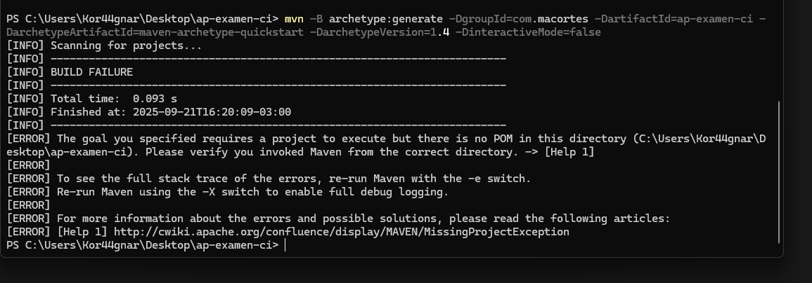
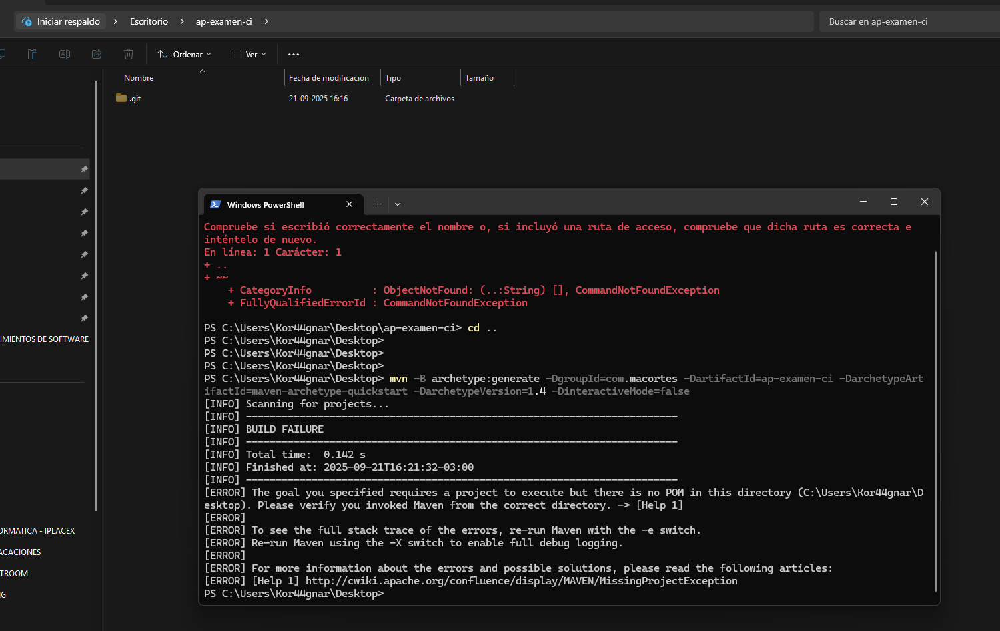
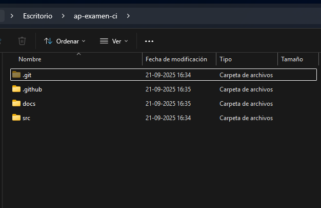
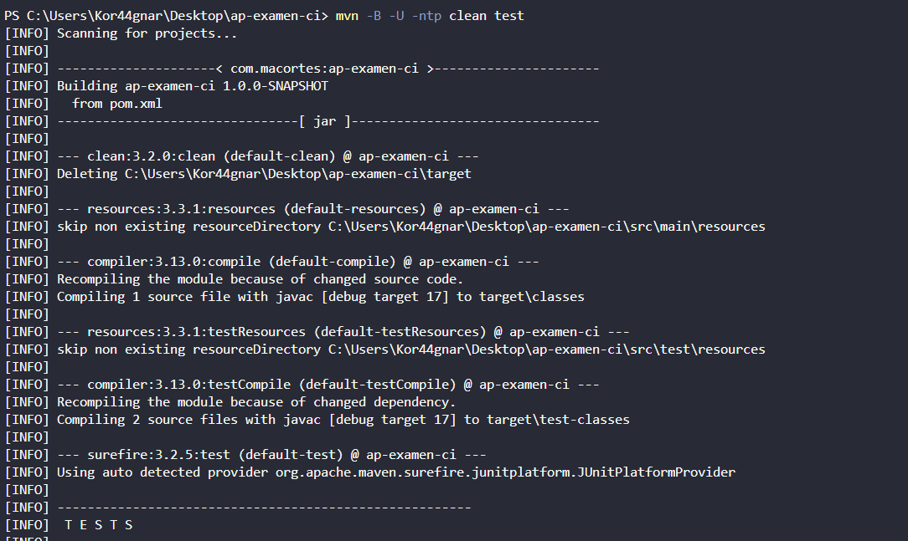

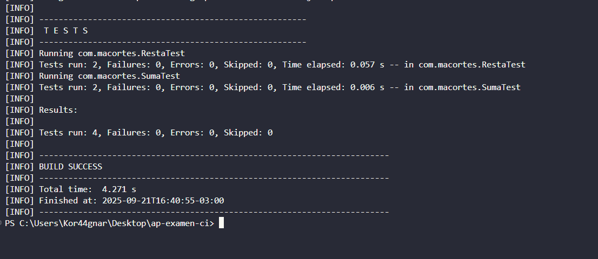
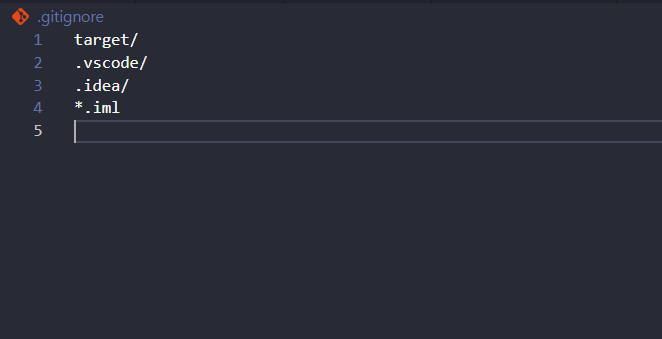
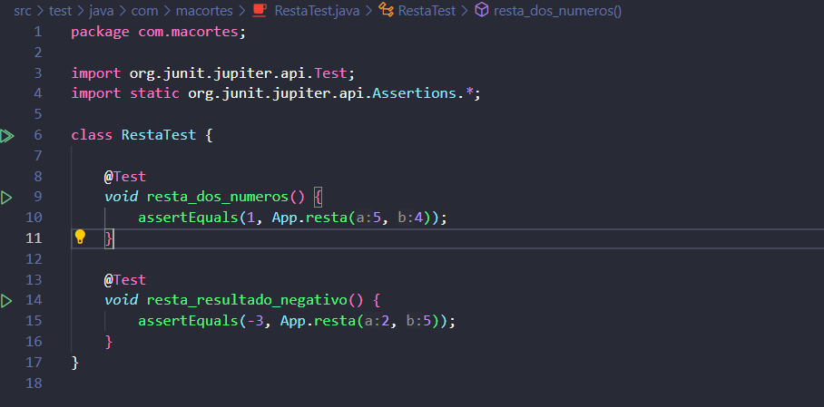
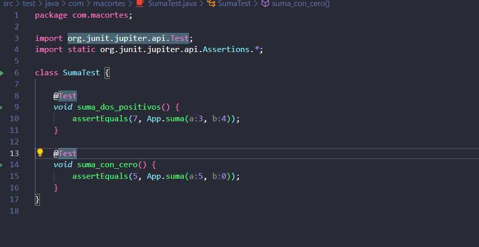
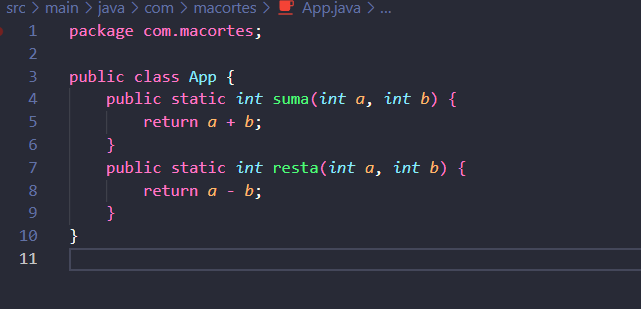

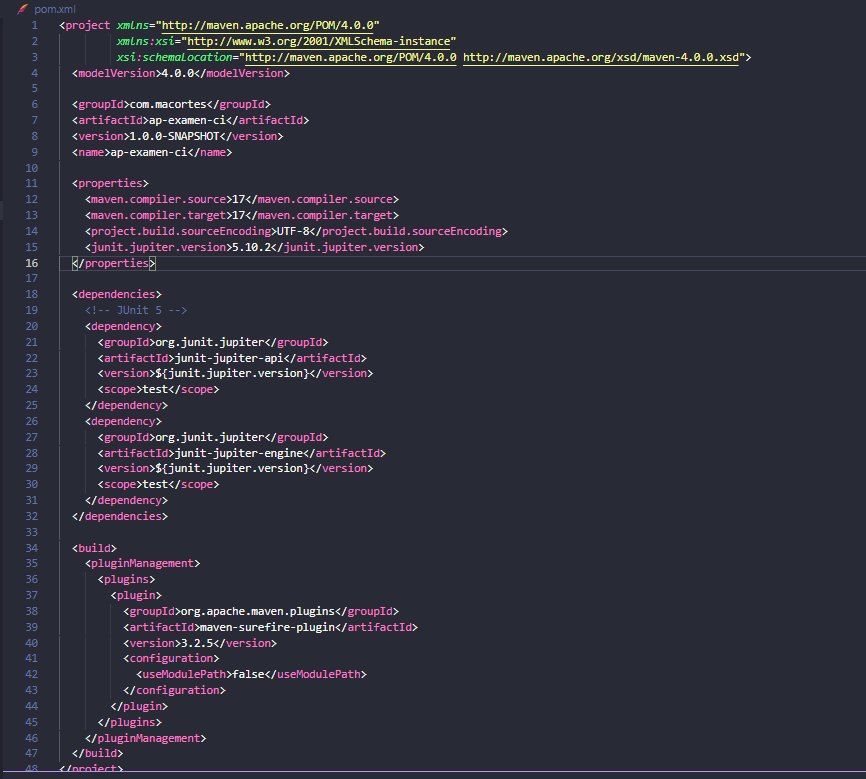
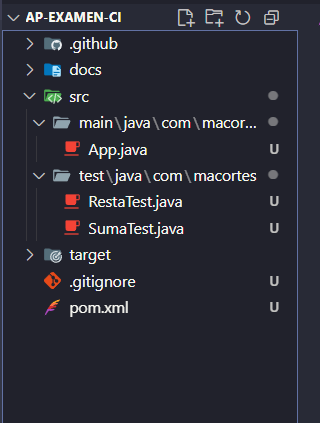
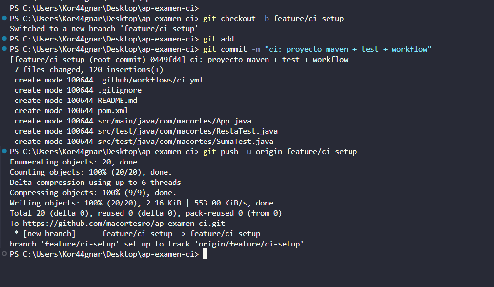
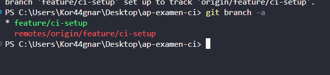
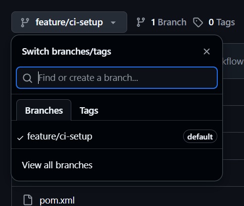

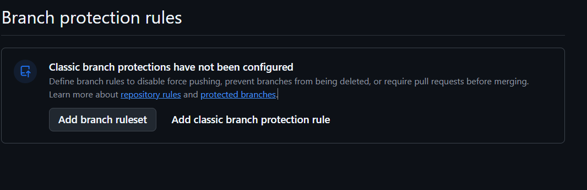
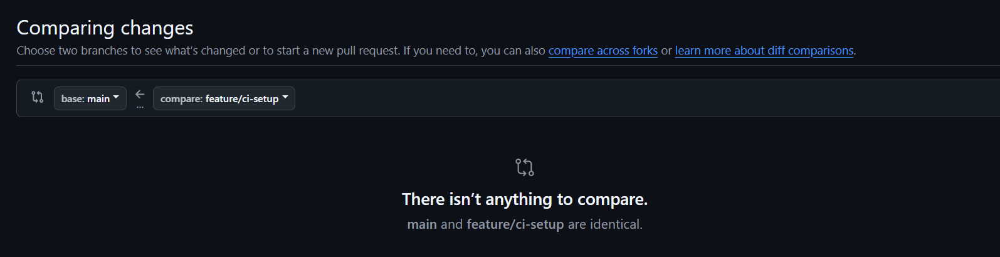

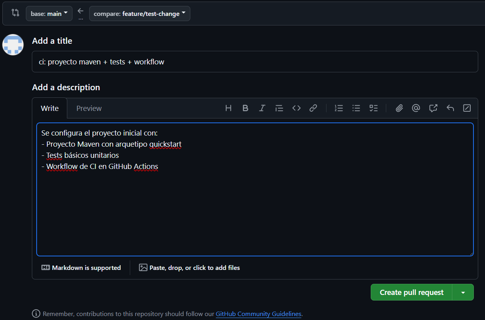
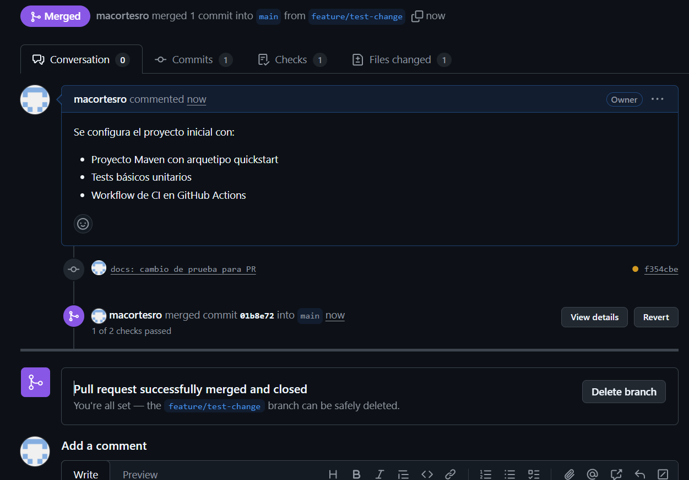

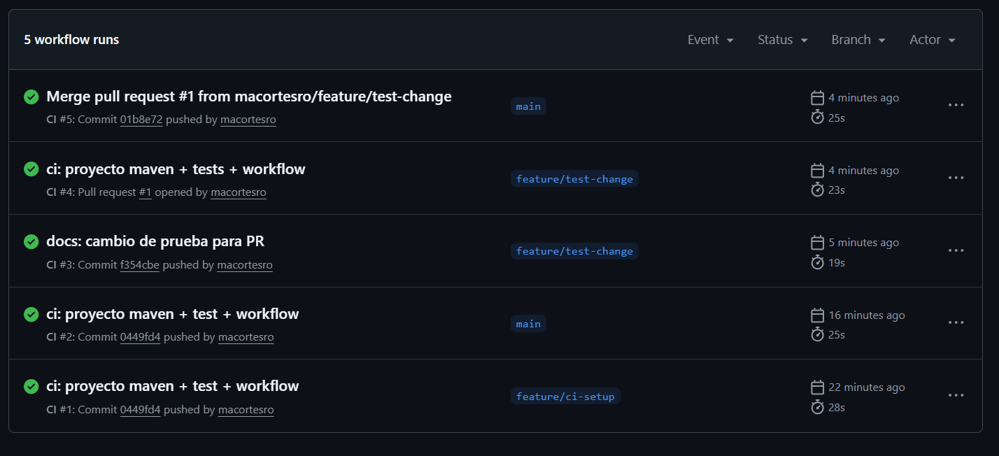
---
