# ap-examen-ci (macortesro)

## Objetivos
- Proyecto Maven con dependencias de prueba.
- Pipelines de CI con GitHub Actions.
- Pipeline de CD con despliegue simulado (Blue/Green + Rollback).

## Actividad 1 - Proyecto Maven
Se configuró un proyecto Maven con:
- Java 17 (Temurin).
- Dependencias de pruebas con **JUnit**.
- Métodos de ejemplo (`suma`, `resta`) probados con **Unit Tests** e **Integration Tests**.

##  Actividad 2 - CI Pipeline

Se configuró un workflow en GitHub Actions (.github/workflows/ci.yml) con los siguientes stages:

Build → Compila el proyecto con Maven.

Unit Tests → Ejecuta pruebas unitarias.

Integration Tests → Ejecuta pruebas de integración.

Acceptance → Construye una imagen Docker y prueba que el servidor HTTP responda en el entorno GREEN.

Ejecución automática en cada push y pull request.

## Actividad 3 - CD Pipeline

Se configuró el workflow deploy.yml para simular despliegues:

Stage build-and-package: genera el JAR y la imagen Docker (app-candidate).

Stage acceptance: levanta entornos BLUE (estable) y GREEN (candidato) en puertos distintos (8080 / 8081).

Stage promote-or-rollback:

Si GREEN pasa pruebas → se promueve como nuevo BLUE (producción).

Si GREEN falla → rollback y se mantiene BLUE estable.


## Docker 

El proyecto incluye un Dockerfile para empaquetar la aplicación en un contenedor:

```bash
FROM openjdk:17-jdk-slim
WORKDIR /app
COPY target/*.jar app.jar
EXPOSE 8080
ENTRYPOINT ["java", "-jar", "app.jar"]
```
## Comandos
```bash
mvn -B -U -ntp clean test

git checkout -b feature/ci-setup
git add .
git commit -m "ci: proyecto maven + tests + workflow"
git push -u origin feature/ci-setup
git push -u origin feature/test-change
git commit -m
git push


```
## Tecnologías usadas

Java 17

Maven

JUnit 5

GitHub Actions (CI/CD)

Docker (Blue/Green Deployment)

## Evidencias


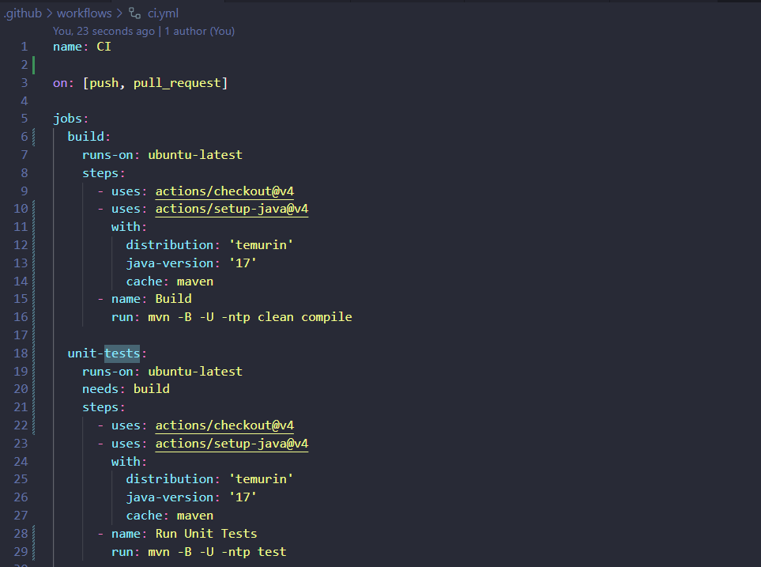
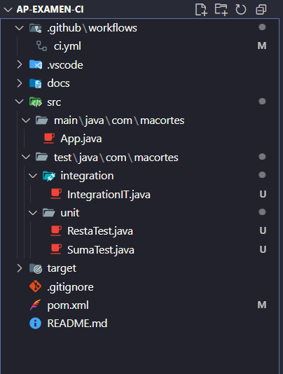
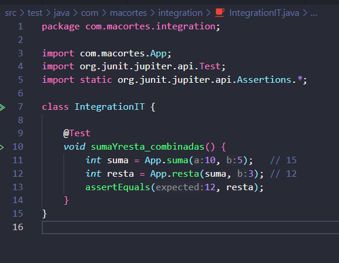
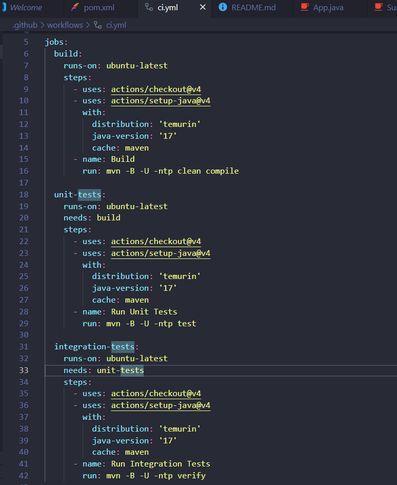
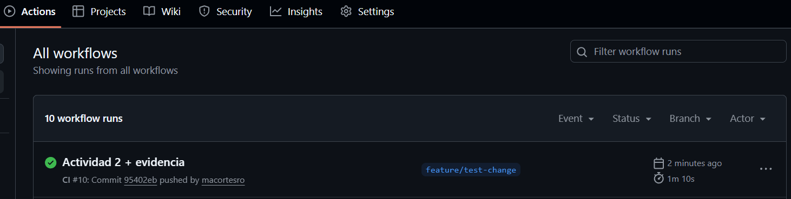

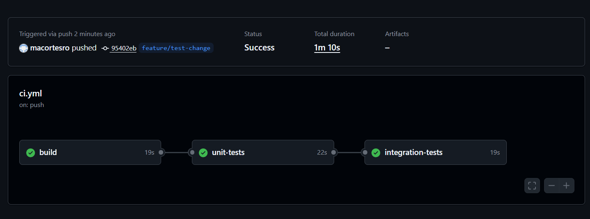


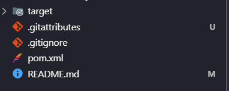

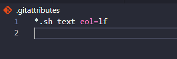
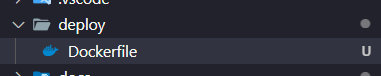
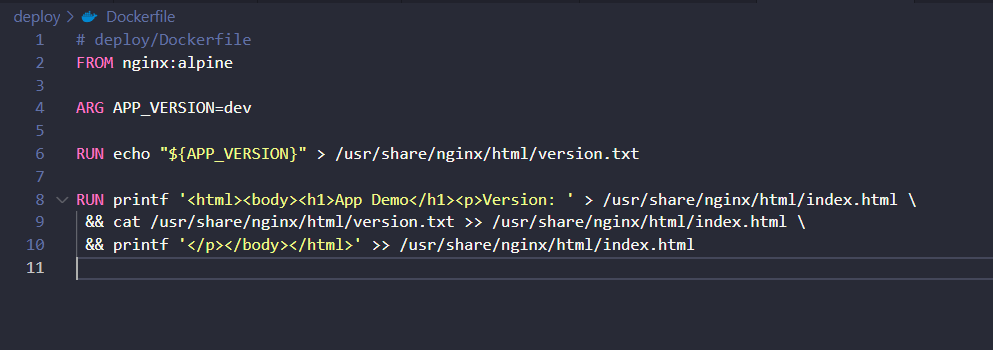
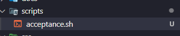
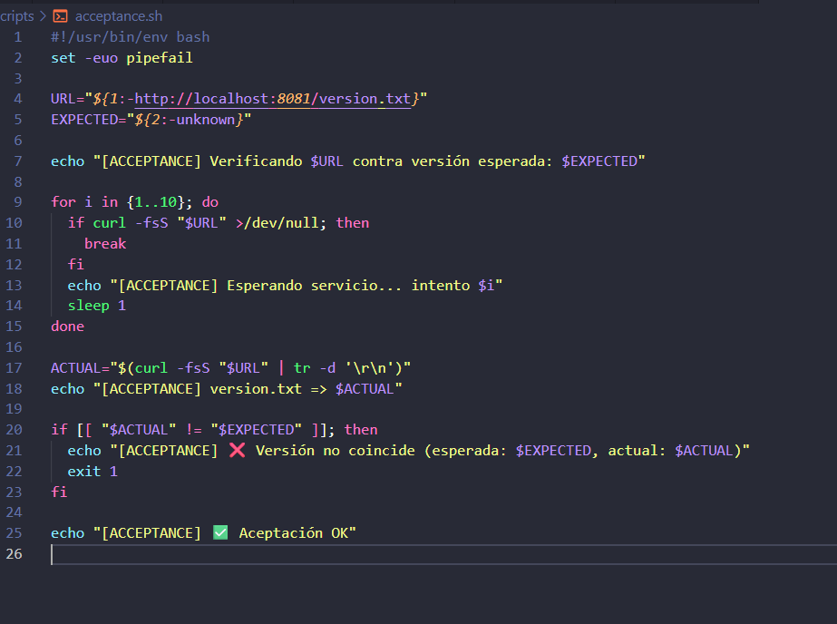

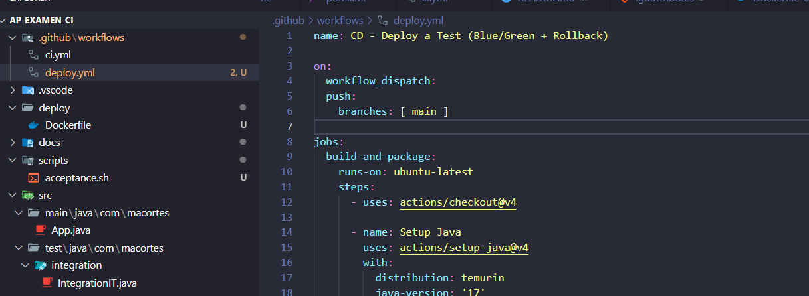
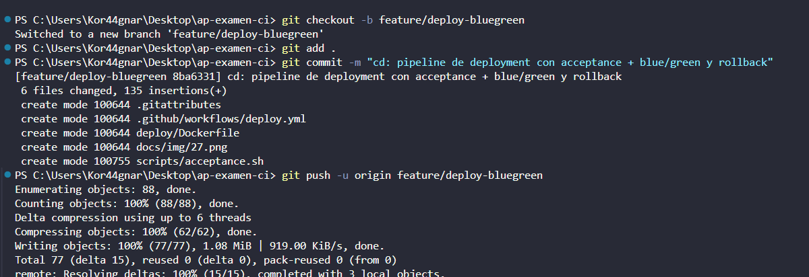
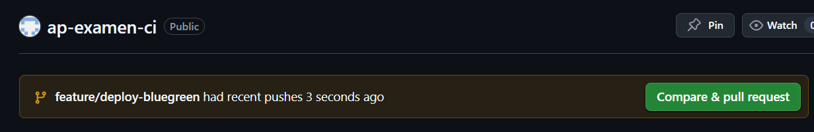

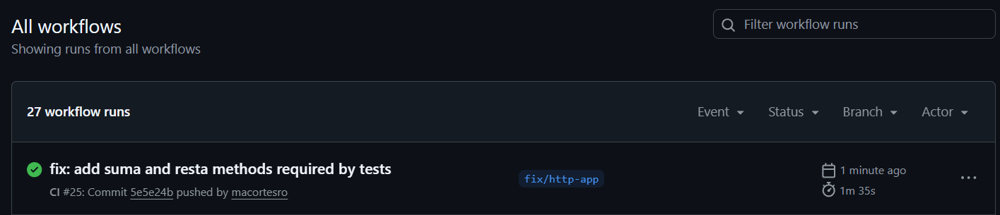

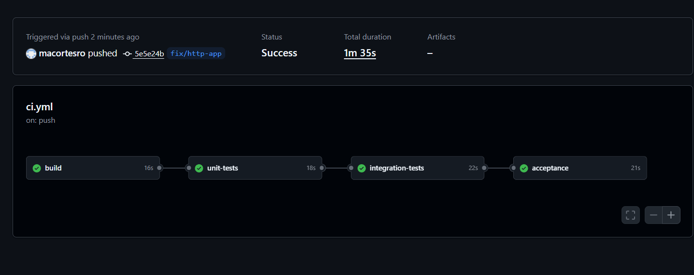
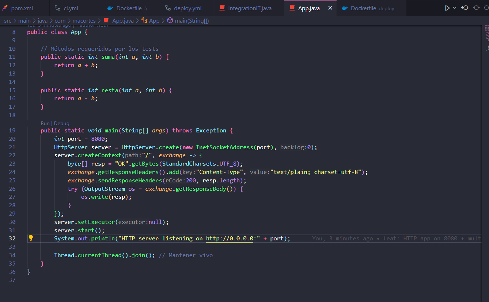
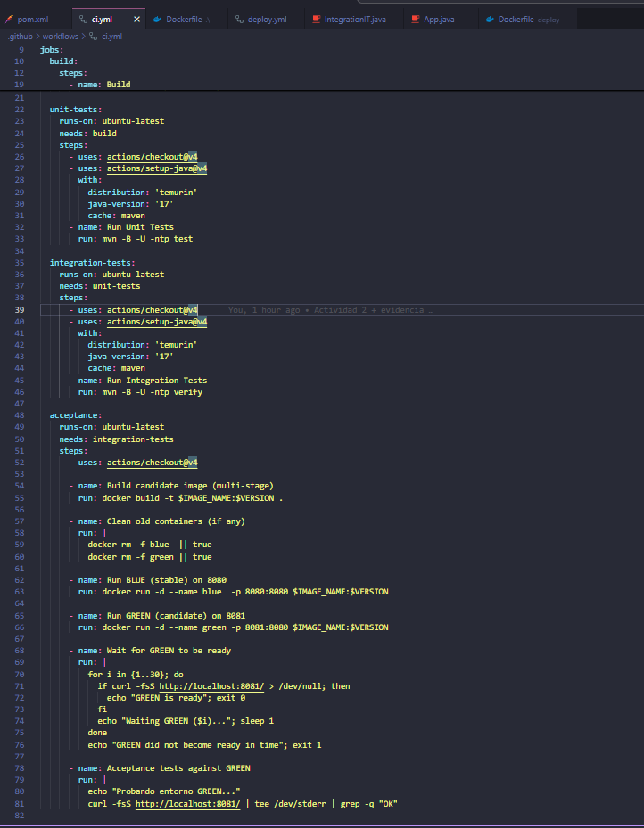
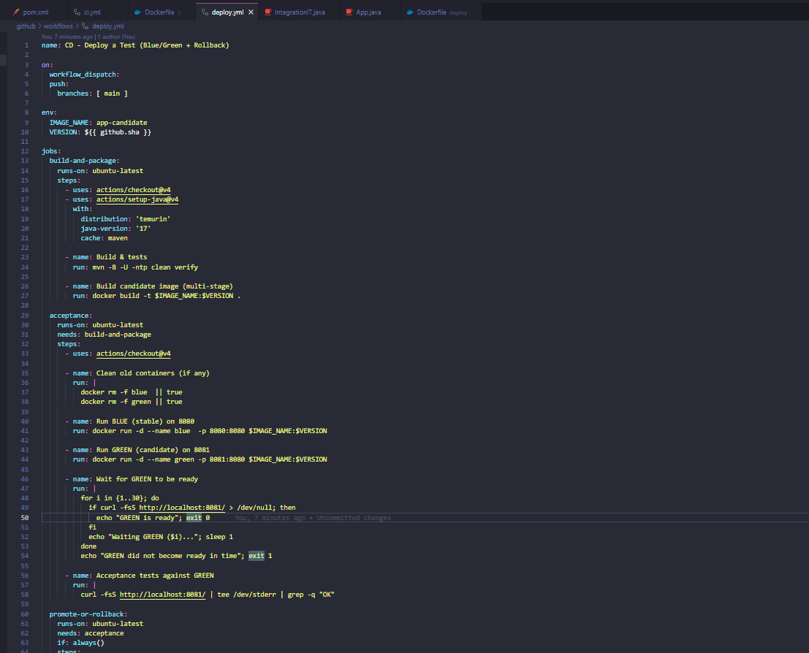


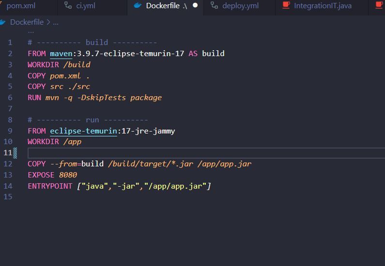
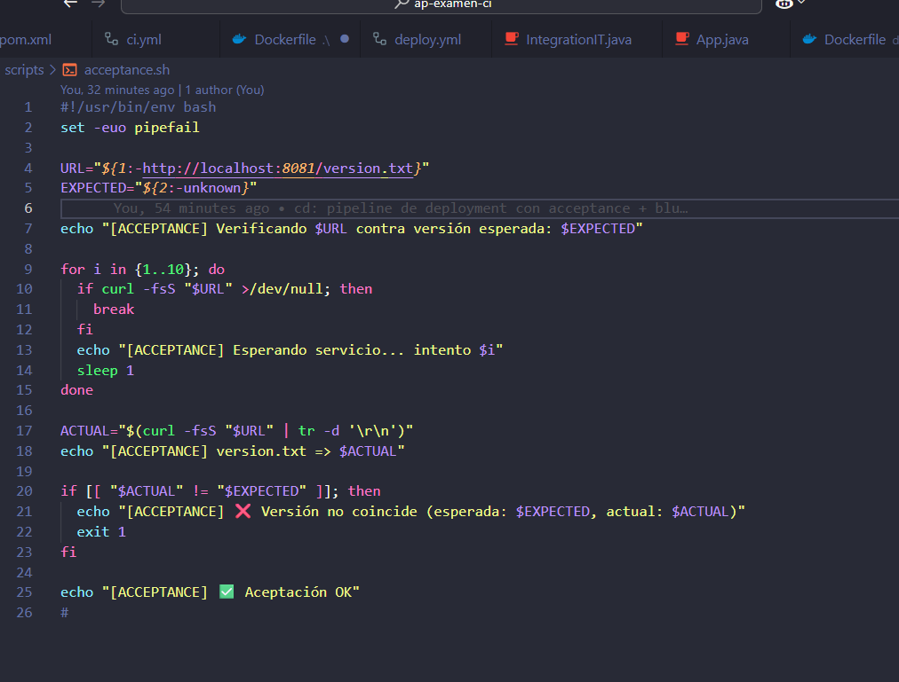


# Autor: Matías CORTÉS ROMERO - EXAMEN AUTOMATIZACIÓN DE PRUEBAS
---
